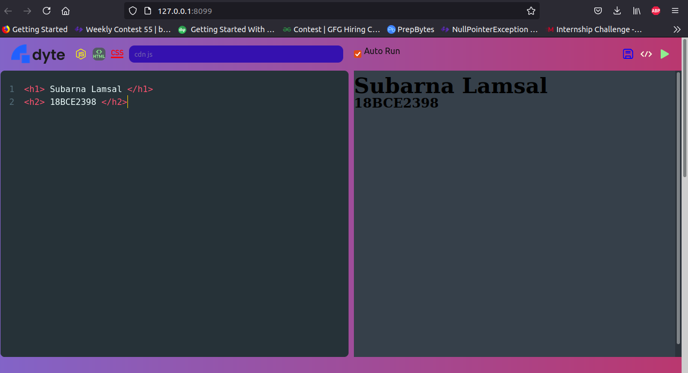

# Dyte-Code-Editor
A code-editor that supports HTML, CSS, Javascript and is live mirrored.




## Install


```sh

$ git clone https://github.com/Subarna578/Dyte-Code-Editor.git

```

## Usage

```sh

$ npm install

$ npm run dev

```
